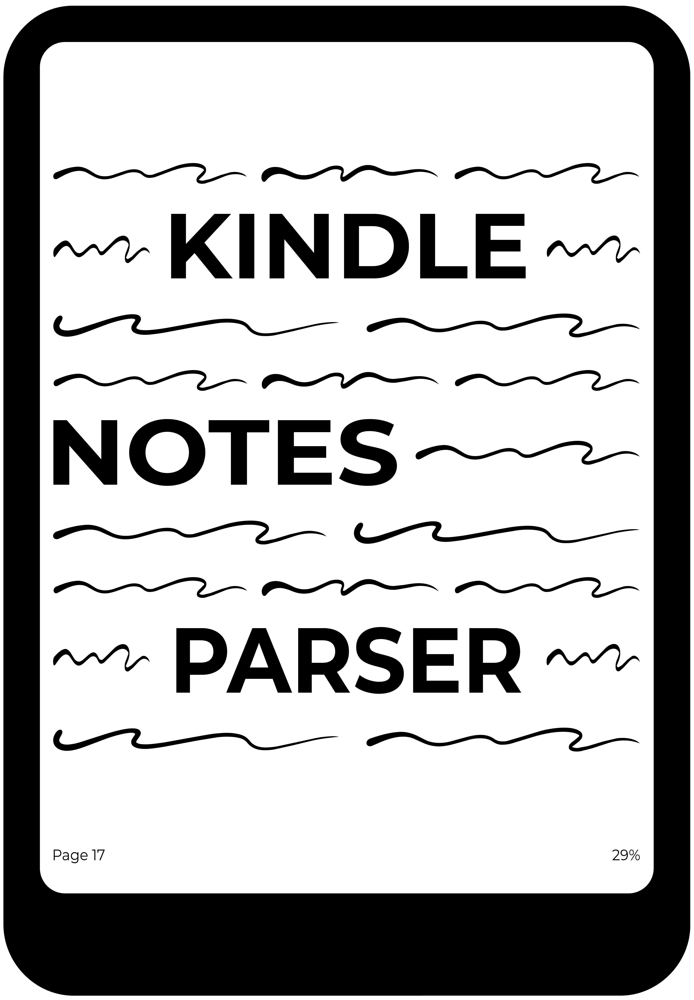

<p align="center">
  
  <br/>
</p>

<p align="center">
  <a href="https://github.com/danibcorr/kindle-notes-parser/actions/workflows/workflow.yml">
    
  </a>
  <a href="https://github.com/danibcorr/kindle-notes-parser/blob/main/LICENSE" target="_blank">
    
  </a>
</p>

## Kindle Notes Parser

Kindle Notes Parser (`knp`) is a Rust CLI tool that extracts and manages highlights from
your Kindle's `My Clippings.txt` file. Ideal for exporting clean notes into personal
knowledge tools (i.e. Obsidian, Notion) or as input for AI models. Licensed under
[MIT](LICENSE).

### Installation

Download prebuilt binaries for Windows, macOS, and Linux from the
[releases](https://github.com/danibcorr/kindle-notes-parser/releases) page.

Alternatively, you can build from source if you have Rust installed:

```bash
git clone https://github.com/danibcorr/kindle-notes-parser
cd kindle-notes-parser
cargo build --release
```

The compiled binary will be at `target/release/knp`.

### Usage

On macOS/Linux, make sure the binary has execution permissions:

```bash
chmod +x knp
```

#### Available Commands

| Command                 | Description                                                                 |
| ----------------------- | --------------------------------------------------------------------------- |
| `knp show` / `knp -s`   | Show all available book titles in the file.                                 |
| `knp parser` / `knp -p` | Extract deduplicated highlights for a selected book to an output file.      |
| `knp delete` / `knp -d` | Remove all notes for a selected book and write the rest to the output file. |
| `knp help` / `knp -h`   | Show help.                                                                  |

#### Flags Reference

| Flag | Long                  | Description                                   |
| ---- | --------------------- | --------------------------------------------- |
| `-i` | `--input-path-notes`  | Path to the Kindle `My Clippings.txt` file.   |
| `-o` | `--output-path-notes` | Path where the output will be saved.          |
| `-a` | `--export-all-notes`  | Export all books at once (only for `parser`). |

#### Examples

Show all book titles:

```bash
knp show -i "My Clippings.txt"
```

Extract highlights for a single book (interactive selection):

```bash
knp parser -i "My Clippings.txt" -o "notes.txt"
```

Export all books to individual files in an `outputs/` directory:

```bash
knp parser -i "My Clippings.txt" --export-all-notes
```

Delete all notes for a selected book:

```bash
knp delete -i "My Clippings.txt" -o "cleaned.txt"
```
